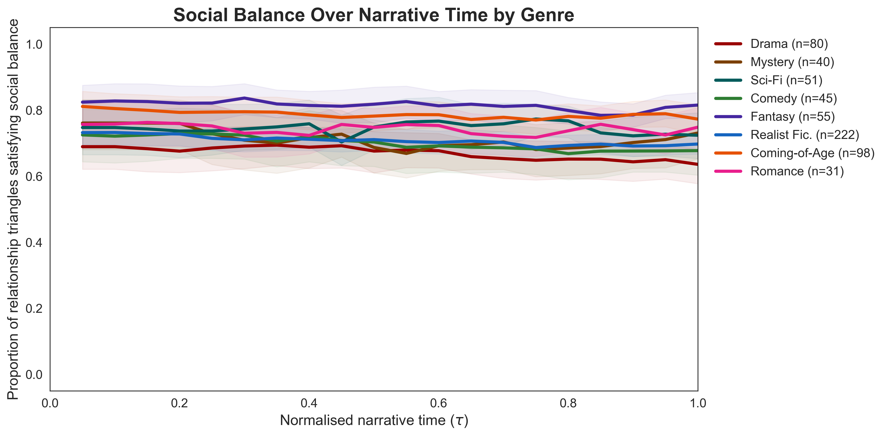
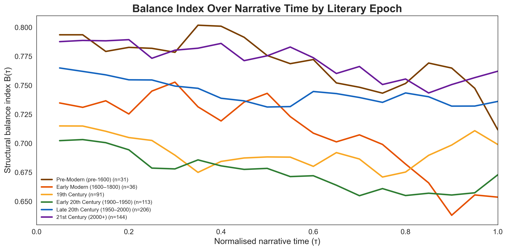
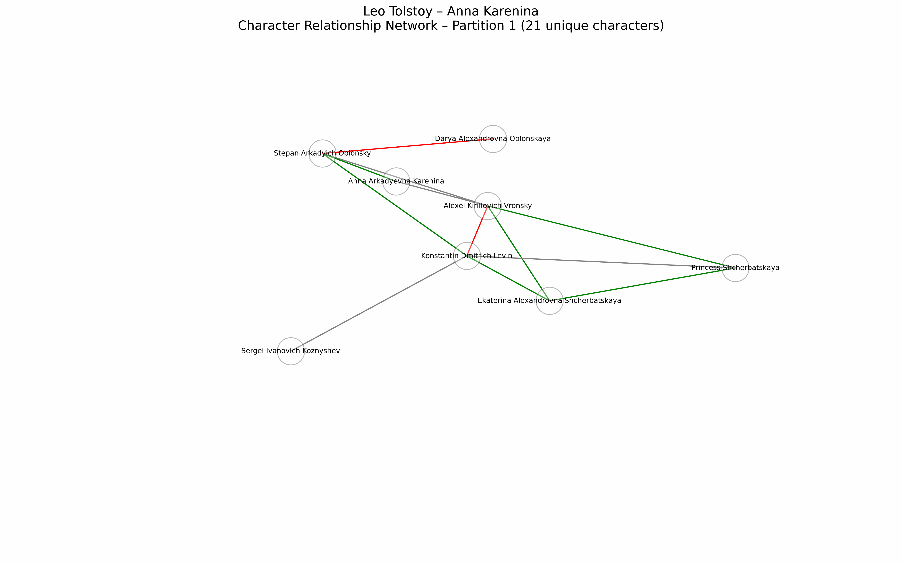

# Temporal Character Networks in Literary Fiction

[](https://github.com/L-Earthling/temporal-literary-networks/releases/latest)
[]
[](https://creativecommons.org/licenses/by/4.0/)
[](https://www.python.org/)

> **TL;DR** — This dataset comprises **626 temporal signed character networks** extracted from literary works, spanning 8 genres and 6 historical epochs. Each network tracks character relationships (positive / negative / neutral) at chapter-level resolution. We show that fictional social worlds obey real-world network laws (small-world structure, superlinear densification) and that structural balance is high, genre-stratified and temporally stable — with a non-monotonic historical arc that peaks in Pre-Modern and contemporary fiction.

---

## Table of Contents
1. [What are Temporal Signed Literary Networks?](#what-are-networks)
2. [Dataset](#dataset)
3. [Key Findings](#key-findings)
4. [Repository Structure](#repository-structure)
5. [Getting Started](#getting-started)
6. [Analysis Pipeline](#analysis-pipeline)
7. [Citation](#citation)
8. [License](#license)

---

## What are Temporal Signed Literary Networks?

Literary narratives are intentionally constructed social systems: characters form alliances, rivalries emerge and resolve and relational structures evolve systematically across chapters. Our framework operationalizes this as a collection of **temporal signed networks**, one per literary work, where:

- **Nodes** = named characters
- **Edges** = character relationships, labeled positive, negative, or neutral
- **Time** = chapter number, normalized to $\tau \in (0,1]$
- **Polarity dynamics** = most-recently-observed edge valence per character pair (most-recent-wins)

Character relationships were extracted from publicly available chapter-level book summaries using an LLM-powered pipeline. The resulting dataset covers **626 works** by **382 authors**, yielding **75,482 character-relationship observations**.

| Statistic | Value |
|---|---|
| Works | 626 |
| Authors | 382 |
| Total edges | 75,482 |
| Genres | 8 |
| Epochs | 6 |
| Median cast size | 15.5 characters |
| Median chapter count | 17 |

---

## Dataset

### ⬇️ Download

**[→ Download Temporal Character Relationship Networks v1](https://github.com/L-Earthling/temporal-literary-networks/releases/latest)**

The release package contains both files below as a single `.zip`.

---

### `temporal_literary_networks.csv` — Character relationship edges

The core dataset. One row = one character-pair observation in one chapter.

| Column | Type | Description |
|---|---|---|
| `Book` | string | `"Author: Title"` — unique book identifier |
| `Chapter` | int | Chapter number (1-indexed) |
| `Character A` | string | First character name |
| `Character B` | string | Second character name |
| `Relationship` | string | `positive`, `negative` or `neutral` |

**Size:** 75,482 rows · 5 columns · semicolon-delimited (`;`)

```python
import pandas as pd
df = pd.read_csv("temporal_literary_networks.csv", sep=";")
```

---

### `temporal_literary_networks_metadata.csv` — Per-work metadata

One row per literary work. Provides genre, epoch, form and author information.

| Column | Type | Description |
|---|---|---|
| `Author` | string | Author name |
| `Book` | string | Title (matches `Book` in networks file) |
| `Year` | int | Year of first publication |
| `Epoch` | string | Historical epoch (6 categories) |
| `Genre_Primary` | string | Primary genre label (8 categories) |
| `Genre_Secondary` | string | Secondary genre label where applicable |
| `Form` | string | `Novel`, `Play`, or `Other` |
| `Remarks` | string | Curation notes (edge cases, multi-genre works) |

**Size:** 626 rows · 8 columns · comma-delimited

```python
meta = pd.read_csv("temporal_literary_networks_metadata.csv")
```

---

### Corpus composition

**By genre:**

| Genre | $n$ | Form (dominant) |
|---|---|---|
| Literary / Realist Fiction | 222 | Novel |
| Coming-of-Age / Bildungsroman | 98 | Novel |
| Tragedy / Drama | 80 | Play (96%) |
| Fantasy / Adventure | 55 | Novel |
| Science Fiction / Dystopia | 51 | Novel |
| Comedy / Satire | 45 | Play (71%) |
| Mystery / Thriller | 40 | Novel |
| Romance / Domestic Fiction | 31 | Novel |

**By historical epoch:** Pre-Modern (pre-1600) · Early Modern (1600–1800) · 19th Century · Early 20th Century (1900–1950) · Late 20th Century (1950–2000) · 21st Century (2000+)

> ⚠️ **Form–genre confound:** Tragedy/Drama and Comedy/Satire are play-dominated; all other genres are predominantly novels. Plays have smaller, denser casts. Cross-genre structural comparisons involving these two genres should be interpreted accordingly.

---

## Key Findings

### 1 · Universal small-world structure
Every eligible book (n=527) satisfies σ_sw > 1 (corpus median 2.67). Fictional social worlds are universally more clustered and shorter-path than random networks of comparable size — a property shared with empirical social networks.

### 2 · Superlinear densification
Fitting E ∝ N^α per book yields a corpus-wide median of α = 1.54; 97.7% of books yield α > 1. Each newly introduced character forms, on average, more than one relationship with the existing cast — mirroring the densification law documented in real-world growing networks.

### 3 · High, genre-stratified, temporally flat structural balance
Balance index B(τ) lies in [0.63, 0.84] across all genres and narrative positions — far above the 0.50 baseline for a randomly signed network. Balance is established early and maintained throughout; no genre shows a systematic narrative arc. Genre ordering is consistent: Fantasy/Adventure and Coming-of-Age occupy the upper band; Tragedy/Drama the lowest (though substantially a form/play effect).



### 4 · Partial alignment with Freytag's arc
The narrative position of minimum balance τ* has a global median of 0.673, falling within the classical climax window [0.60, 0.75]. Five of eight genres align with this window; Science Fiction/Dystopia deviates markedly (τ* = 0.84).

### 5 · U-shaped historical arc in structural balance
Balance is highest in Pre-Modern and 21st-Century works, lowest in Early 20th-Century fiction — paralleling the historical arc of psychological realism and modernist ambiguity.



### 6 · Genre classification: weak but above-chance signal
Random Forest (142 temporal network features, 10-fold CV): macro-F1 = 0.168, substantially above stratified-random baseline (0.143). Tragedy/Drama is the most structurally distinctive class (F1 = 0.44). Entropy trajectory features dominate feature importance.

---

### Network evolution — example

The animation below shows the temporal evolution of a character-relationship network across chapters, with green edges = positive, red = negative, grey = neutral.

<!-- Replace w actual GIF path once uploaded -->


---

## Repository Structure

```
temporal-literary-networks/
│
├── README.md
├── LICENSE
│
├── data/
│   ├── temporal_literary_networks.csv       # 75,482 character-relationship edges
│   └── temporal_literary_networks_metadata.csv       # Per-work genre/epoch/form metadata
│
├── figures/
│   ├── A3_edge_polarity_by_genre.png   # Genre social tone (edge polarity composition)
│   ├── B1_density_trajectory.png       # Network density over narrative time
│   ├── C1_balance_trajectory.png       # Structural balance B(τ) by genre ← hero figure
│   ├── C4_triad_fractions.png          # Triad-type decomposition by genre
│   ├── E_pairwise_genre_f1.png         # Pairwise genre discriminability matrix
│   ├── E2_feature_importance.png       # Top-10 RF feature importances
│   ├── F1_balance_by_epoch.png         # Balance by historical epoch (U-shape)
│   └── example_network_evolution.gif   # Example per-book network animation
│
├── notebooks/
│   └── analysis.ipynb        # Analysis pipeline (Blocks 0–G)
│
└── paper/
    └── preprint.pdf # Preprint (to be added)
```

---

## Getting Started

### Requirements

```bash
pip install pandas numpy matplotlib scikit-learn networkx scipy
```

### Quick start — load and explore

```python
import pandas as pd

# Load data
df = pd.read_csv("data/temporal_literary_networks.csv", sep=";")
meta = pd.read_csv("data/temporal_literary_networks_metadata.csv")

# Inspect a single book
book = "George Orwell: 1984"
edges = df[df["Book"] == book]
print(edges.head(10))

# Count edges per chapter
print(edges.groupby("Chapter")["Relationship"].value_counts().unstack(fill_value=0))

# Join with metadata
df_full = df.merge(meta, on="Book", how="left")
print(df_full["Genre_Primary"].value_counts())
```

### Run the full analysis

Open `notebooks/analysis.ipynb` in Jupyter and run cells in order (Blocks 0 → 1 → A → B → C → D → E → F). Outputs are saved to `figures/` and `results/` subdirectories.

---

## Analysis Pipeline

The notebook (`analysis.ipynb`) is organized into sequential blocks:

| Block | Content |
|---|---|
| **0 – Setup** | Paths, dependencies, global configuration |
| **1 – Preprocessing** | Load CSVs, build cumulative chapter snapshots, normalize narrative time |
| **A – Aggregate Properties** | Cast size, density, clustering, small-world coefficient, Kruskal–Wallis genre tests |
| **B – Temporal Dynamics** | Density/entropy/centrality trajectories; superlinear densification (α); edge burstiness |
| **C – Structural Balance** | B(τ) trajectories; Freytag argmin test; triad-type decomposition |
| **D – Temporal Motifs** | 3-event signed polarity sequences on recurring character pairs |
| **E – Classification** | Random Forest + baselines; pairwise discriminability; feature importance |
| **F – Epoch & Author** | Historical epoch stratification; author-level case studies |
| **G – Per-book outputs** | Individual network files and plots for each work |


---

## License

- **Dataset** (`data/`): [Creative Commons Attribution 4.0 International (CC BY 4.0)](https://creativecommons.org/licenses/by/4.0/) — free to use, share and adapt with attribution.
- **Code** (`notebooks/`): [MIT License](LICENSE)

Character relationship data was extracted from publicly available book summaries. Original literary works remain the property of their respective authors and publishers.

---

*Saarland University · German Research Center for AI (DFKI) · 2026*
